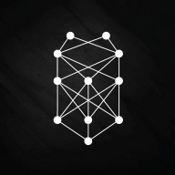
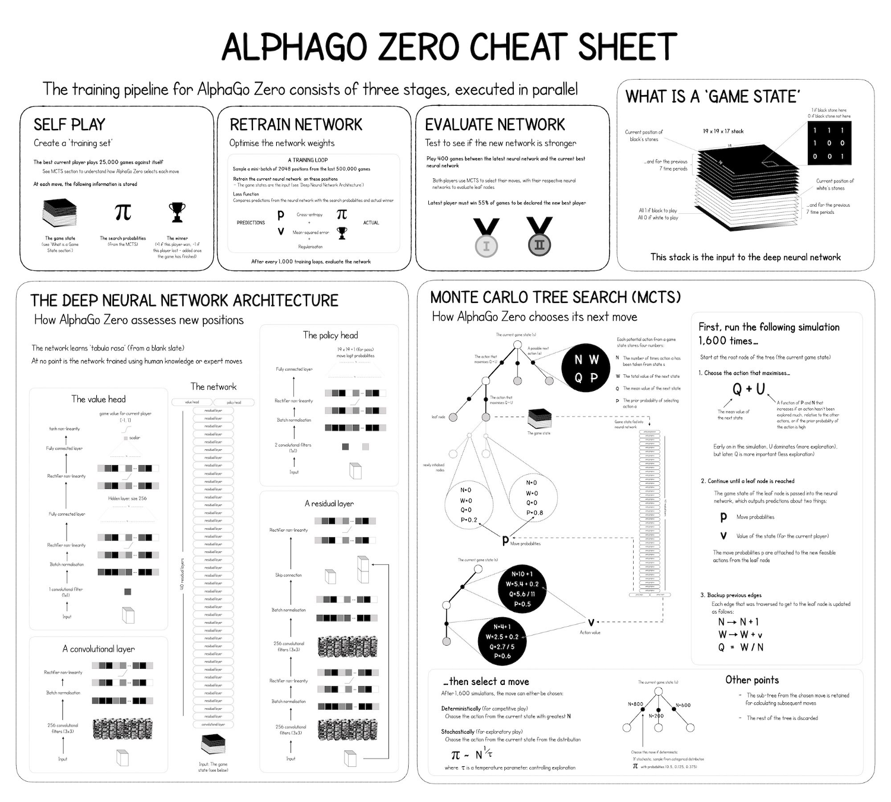
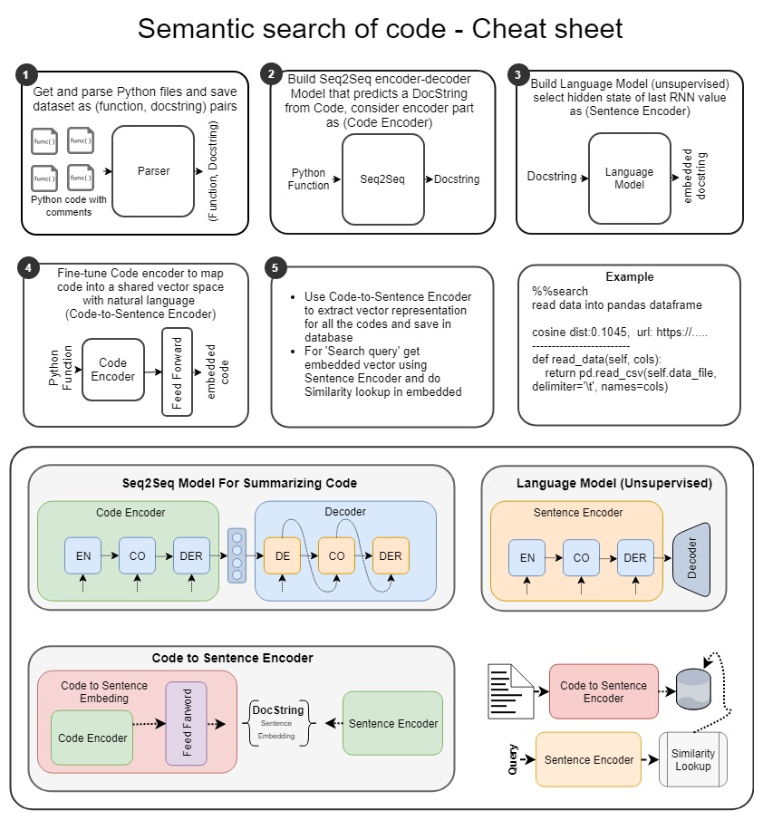
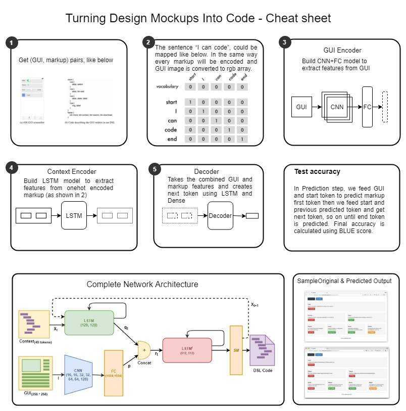
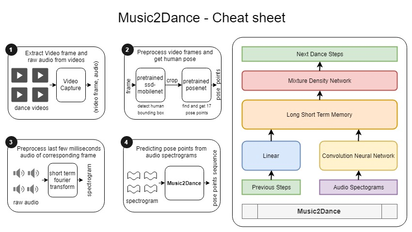

# Top DeepLearning tutorials and curated projects

## Basics

#### Neural Networks
* [Neural Networks Demystified - Youtube](https://www.youtube.com/watch?v=bxe2T-V8XRs&list=PLiaHhY2iBX9hdHaRr6b7XevZtgZRa1PoU)
* [A Tiny Toy Neural Network from Scratch - Code + Walk Through](http://iamtrask.github.io/2015/07/12/basic-python-network/)
* [Mastering the core concepts of neural networks - Very well explained Theory + Code](http://neuralnetworksanddeeplearning.com/chap1.html)
* [Backpropagation explained via scrollytelling - Animated Explanation](https://google-developers.appspot.com/machine-learning/crash-course/backprop-scroll/)
* [How Backpropogation works? - Theory + Code](http://neuralnetworksanddeeplearning.com/chap2.html)
* [Gradient Descent via a very simple toy example - Code + Walk Through](http://iamtrask.github.io/2015/07/27/python-network-part2/)
* [Deep Neural Network in few lines of code using library - Explanation + Code + Walk through](https://blog.floydhub.com/my-first-weekend-of-deep-learning/)

#### Convolution Neural Network (CNN)
* [CNN from Scratch - Theory + Code ](http://neuralnetworksanddeeplearning.com/chap6.html#introducing_convolutional_networks)
* [CNN for Visual Recognition - Theory](http://cs231n.github.io/convolutional-networks/)

#### Recurrent Neural Networks (RNN)
* [RNN from scratch - Youtube](http://course.fast.ai/lessons/lesson6.html)
* [RNN via a very simple toy example - Code + Walk through](https://iamtrask.github.io/2015/11/15/anyone-can-code-lstm/)
* [How to build a Recurrent Neural Network in TensorFlow - Theory + Code](https://medium.com/@erikhallstrm/hello-world-rnn-83cd7105b767)
* [Introduction to Sequence to Sequence Learning in Keras - Theory + Code](https://blog.keras.io/a-ten-minute-introduction-to-sequence-to-sequence-learning-in-keras.html)
* [Understanding Long Short Term Memory (LSTM) - Theory](https://medium.com/mlreview/understanding-lstm-and-its-diagrams-37e2f46f1714)
* [Seq2seq models with attention - Animated Explanation](https://jalammar.github.io/visualizing-neural-machine-translation-mechanics-of-seq2seq-models-with-attention/)

#### General Advisorial Networks (GAN)
* [GAN Explained - Code + Explanation](https://towardsdatascience.com/gan-by-example-using-keras-on-tensorflow-backend-1a6d515a60d0)
* [Collection of GAN's - Code](https://github.com/wiseodd/generative-models)

#### Courses

| [Deeplearning.ai -*Andrew NG*](https://www.deeplearning.ai/) | [Fast.ai -*Jeremy Howard*](http://www.fast.ai/) | [NPTEL(DL) -*Mitesh M. Khapra*](https://onlinecourses.nptel.ac.in/noc18_cs41/preview)|
| :--- | :---| :--- |
|<ul><li> Neural Networks and Deep Learning </li><li> Improving Deep Neural Networks </li><li> Structured Machine Learning Projects</li> <li> Convolutional Neural Networks</li><li> Sequence Models </li></ul>|<ul><li> CNN's, RNN's </li><li> Image Recognition, Object Detection </li><li> NLP Classification, Embedding </li><li> Sequence Models, Neural translation </li><li> Darknet, Cycle GAN</li><li> Segmentation with UNets</li></ul>|<ul><li>MLP's, FeedForward Network</li><li>Backpropagation, Gradient Descent</li><li>PCA, Singular Value Decomposition</li><li>Regularization, Dataset augmentation</li><li>Auto encoders, CNN's, RNN's</li><li>Encoder Decoder Models, Attention Mechanism</li></ul>|

#### Frameworks

| Name | Language | Link |
| ---  |   ---    | --- |
|TensorFlow | Python | |
| PyTorch | Python | |
| Keras (higher-level API) | Python | |
| TFLearn (higher-level API) | Python | |
| TensorFlow.js | Java Script | |
| Deeplearning4j | Java | |

## Curated DeepLearning Projects

|Type | Title | Code | Resources | CheatSheet |
| --- | --- | --- | --- | --- |
| Game Self Play | AlphaZero (Self Learning board games)	| [Code](https://github.com/AppliedDataSciencePartners/DeepReinforcementLearning) |  [Article](https://medium.com/applied-data-science/how-to-build-your-own-alphazero-ai-using-python-and-keras-7f664945c188) |  |
|Hybrid NLP| Semantic Code Search (Searching for code in Natural Language) | [Code](https://github.com/hamelsmu/code_search) | [Article](https://towardsdatascience.com/semantic-code-search-3cd6d244a39c)| |
|NLP|Attention is all we need (Language Translation)|[Code](https://github.com/harvardnlp/annotated-transformer)| [Walk through](http://nlp.seas.harvard.edu/2018/04/03/attention.html), [Explanation](https://jalammar.github.io/illustrated-transformer/)|
|Image+Text Processing|Pix2Code (Generating UI code from screenshot/handdrawn image)| [Code](https://blog.floydhub.com/turning-design-mockups-into-code-with-deep-learning/) | [Paper](https://arxiv.org/abs/1705.07962) and its [Code](https://github.com/tonybeltramelli/pix2code) | |
|Image Processing|Deep Steganography (Hidding an image in another image)|[Code](https://github.com/harveyslash/Deep-Steganography)|[Paper](https://papers.nips.cc/paper/6802-hiding-images-in-plain-sight-deep-steganography), [Blog](https://buzzrobot.com/hiding-images-using-ai-deep-steganography-b7726bd58b06)||
|NLP|Spell Checker using word embedding | [Code](https://github.com/er214/spellchecker) | [Article](https://blog.usejournal.com/a-simple-spell-checker-built-from-word-vectors-9f28452b6f26)|
|NLP|Learn to Write Programs (Generating code using sample Input/Output's)|[Code](https://github.com/dkamm/deepcoder)|[Paper](https://openreview.net/pdf?id=ByldLrqlx)|
|NLP|URLNet (Malicious URL Detection)| [Code](https://github.com/Antimalweb/URLNet)|[Paper](https://arxiv.org/abs/1802.03162)|
|Image Processing|UNet based nucleus detection|[Code](https://www.kaggle.com/c/data-science-bowl-2018/discussion/55118)|[Paper](https://arxiv.org/pdf/1611.08303.pdf)|
|NLP|Named Entity Recognition (Tagging every word in a sentence) | [Code](https://github.com/guillaumegenthial/sequence_tagging) | [Article](https://guillaumegenthial.github.io/sequence-tagging-with-tensorflow.html)|
|Question Answering|QA-Net(CNN+Attention based QA Model)| [Code](https://github.com/NLPLearn/QANet) |[Article](https://medium.com/@minsangkim/implementing-question-answering-networks-with-cnns-5ae5f08e312b), [QA-Net explained](https://towardsdatascience.com/how-the-current-best-question-answering-model-works-8bbacf375e2a)|
|Question Answering| QA Using Sentence Embedding | [Code](https://github.com/aswalin/SQuAD)| [Article](https://towardsdatascience.com/building-a-question-answering-system-part-1-9388aadff507)|
|Question Answering| R-Net (RNN+Attention based QA Model) | [Code](https://github.com/YerevaNN/R-NET-in-Keras/)|[Explaining R-Net](https://codeburst.io/understanding-r-net-microsofts-superhuman-reading-ai-23ff7ededd96), [Article](http://yerevann.github.io/2017/08/25/challenges-of-reproducing-r-net-neural-network-using-keras/)|
|NLP|Text Summerization (summarize text and generate features from Github Issues) | [Code](https://github.com/hamelsmu/Seq2Seq_Tutorial)|[Article](https://towardsdatascience.com/how-to-create-data-products-that-are-magical-using-sequence-to-sequence-models-703f86a231f8)|
|Code fix|DeepFix: Fixing Common C Language Errors by Deep Learning|[Code](http://iisc-seal.net/deepfix)|[Paper](http://www.iisc-seal.net/publications/aaai17.pdf), [Paper2](https://arxiv.org/pdf/1801.10467)|
|Time series|Playing trading games with deep reinforcement learning|[Code](https://github.com/golsun/deep-RL-time-series)|[Paper](https://arxiv.org/ftp/arxiv/papers/1803/1803.03916.pdf)|
|Seq2Seq|Music2Dance: Generating Dance steps for a given music|[Code](https://github.com/ajay-sreeram/Music2Dance)|[Results](https://www.youtube.com/watch?v=Db79bIJvxdw)||

## Useful links:

| Description | Link |
| --- | --- |
| Machine Learning Algorithms: Which One to Choose for Your Problem | [Blog](https://blog.statsbot.co/machine-learning-algorithms-183cc73197c) |
| How to solve 90% of NLP problems: a step-by-step guide | [Blog](https://blog.insightdatascience.com/how-to-solve-90-of-nlp-problems-a-step-by-step-guide-fda605278e4e) |
| Minimal and clean examples of reinforcement learning algorithms | [Code](https://github.com/rlcode/reinforcement-learning) |
|Applied Machine Learning -by Aaqib Saeed|[Blog](http://aqibsaeed.github.io/)|
| Neural Models for Information Retrieval | [Talk](https://www.youtube.com/watch?v=g1Pgo5yTIKg) |
| A brief and great explanation of [World Models](https://worldmodels.github.io/) | [Blog](https://medium.com/applied-data-science/how-to-build-your-own-world-model-using-python-and-keras-64fb388ba459)|
| Artificial Intelligence and Games | [Book](http://gameaibook.org/book.pdf) |
| MolGAN (An implicit generative model for small molecular graphs) - A nice example of GAN + RL | [Paper](https://arxiv.org/pdf/1805.11973.pdf)|
| Attention to characters in Neural Sequence Models | [Blog](http://www.marekrei.com/blog/attending-to-characters-in-neural-sequence-labeling-models/)|
| Capsule Networks Explained | [Blog](https://hackernoon.com/what-is-a-capsnet-or-capsule-network-2bfbe48769cc)|
| AlphaGo Documentary | [Movie](https://www.alphagomovie.com/)|
| A Tensorflow JS example demonstrating transfer learning | [Code](https://js.tensorflow.org/tutorials/webcam-transfer-learning.html)|
| Ask me Anything (Dynamic Memory Network for basic Question Answering task) | [Paper](https://arxiv.org/pdf/1506.07285.pdf)|
| OneShot Concept Learning Through conversation interaction | [Paper](https://arxiv.org/pdf/1805.00462.pdf)|
| Understanding feature engineering | [Blog](https://towardsdatascience.com/understanding-feature-engineering-part-1-continuous-numeric-data-da4e47099a7b)|
| The Illustrated BERT, ELMo, and co. (How NLP Cracked Transfer Learning) | [Blog](https://jalammar.github.io/illustrated-bert/)
